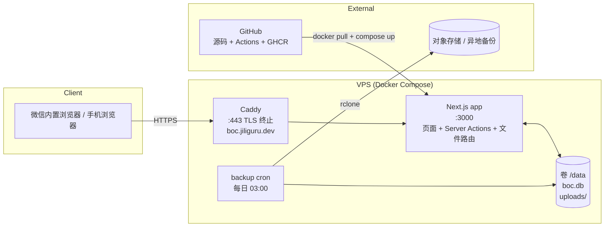
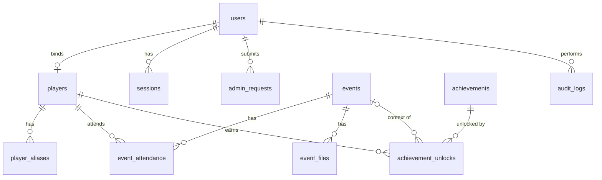

# BOC 技术架构设计

| 项目 | 内容 |
|---|---|
| 版本 | v0.1 草稿 |
| 日期 | 2026-09-05 |
| 对应需求 | [requirements.md](requirements.md) |

---

## 1. 选型结论

**结论：VPS 上用 Docker Compose 跑一个 Next.js 全栈应用 + SQLite 数据库 + 本地文件存储，Caddy 做反向代理和自动 HTTPS，GitHub Actions 自动构建镜像并部署。**

一句话理由：这是一个几十个人用、每周一次写入高峰的站点。单进程 + 单文件数据库完全够用，而且备份、迁移、回滚都是"复制一个目录"的事。你已经有 VPS 和域名，不需要再引入云服务。

### 1.1 方案对比

| 维度 | A. VPS + Docker + SQLite（推荐） | B. Azure App Service / Static Web Apps + Azure SQL + Blob | C. Vercel + Supabase |
|---|---|---|---|
| 月成本 | 0（已有 VPS） | 约 15–30 CHF（App Service B1 + SQL Basic + Blob） | 0（免费额度内），但 Supabase 免费项目 7 天无活动会暂停 |
| 运维复杂度 | 低：一个 compose 文件，两个容器 | 中：要配 App Service、SQL 防火墙、Blob SAS、自定义域名证书 | 低，但要管两家平台的配置 |
| 数据所有权 | 完全自有 | 在 Azure | 在 Supabase（美国 / 欧洲区可选） |
| 备份 | `cp` 一个目录 + 每日同步到对象存储 | Azure 自带，但恢复流程繁琐 | 免费版只有 7 天 PITR |
| 文件存储 | 本地磁盘 | Blob Storage | Supabase Storage（1 GB 免费） |
| 扩展性 | 到几千用户都没问题；再大换 Postgres | 高 | 高 |
| 冷启动 | 无 | Static Web Apps 的 Functions 有冷启动 | Vercel serverless 有冷启动 |
| 结论 | **选它** | 对本项目过重 | 可行，但引入两个外部依赖，收益不大 |

### 1.2 数据库：SQLite 而非 Postgres

| | SQLite | Postgres |
|---|---|---|
| 写入并发 | 单写多读；WAL 模式下对本项目绰绰有余 | 高 |
| 运维 | 无独立进程，一个文件 | 多一个容器、一套账号密码、一套备份工具 |
| 备份 | `sqlite3 .backup` 或 Litestream 连续复制 | `pg_dump` |
| 迁移到对方 | Drizzle ORM 换 driver + 改少量 SQL 方言即可 | — |

如果将来要多实例部署或数据量上百万行，再换 Postgres；Drizzle 的 schema 定义基本可以复用。

### 1.3 应用框架：Next.js 全栈

选择理由：

- 一个代码库同时解决页面、API、文件上传和权限，不需要前后端分离的额外联调。
- Server Actions 让"手机上点一下出席状态就保存"这种交互实现成本很低。
- 生态成熟，组件库（shadcn/ui）和表单校验（zod）拿来即用。

**备选：Django + Tailwind + HTMX。** 如果你更习惯 Python，Django 自带的 admin 后台能省掉大部分管理页面开发；代价是前端交互没那么顺滑，移动端 UI 要手写。见需求文档 Q9。

---

## 2. 技术栈

| 层 | 选择 | 版本 / 说明 |
|---|---|---|
| 语言 | TypeScript | strict 模式 |
| 框架 | Next.js（App Router、Server Actions、standalone 输出） | 15.x |
| UI | Tailwind CSS + shadcn/ui（Radix） | 移动端优先 |
| 表单校验 | zod | 前后端共用 schema |
| ORM | Drizzle ORM + better-sqlite3 | 迁移文件入库，容器启动时自动执行 |
| 数据库 | SQLite（WAL 模式） | 文件位于 `/data/boc.db` |
| 认证 | 自实现：bcrypt 哈希 + 数据库会话表 + HTTP-only cookie | 不引入 Auth.js，需求只有用户名密码 |
| 文件存储 | 本地磁盘 `/data/uploads/` | 通过应用路由鉴权后返回，不直接暴露目录 |
| 图片处理 | sharp | 生成缩略图、去除 EXIF |
| 测试 | Vitest（单元）+ Playwright（少量端到端） | |
| 包管理 | pnpm | |
| 反向代理 | Caddy | 自动申请 Let's Encrypt 证书 |
| 容器 | Docker + Docker Compose | |
| CI/CD | GitHub Actions → GHCR → SSH 部署 | |
| 备份 | 每日 cron：`sqlite3 .backup` + `tar` uploads → rclone 到对象存储 | 备选 Litestream |

---

## 3. 系统结构



请求流程：

1. Caddy 收到 HTTPS 请求，转发给应用容器。
2. 应用的中间件读取会话 cookie，查会话表得到用户与角色；未登录跳转 `/login`。
3. 页面在服务端渲染；写操作走 Server Actions，每个 action 内部再次校验权限。
4. 文件访问走 `/files/[id]` 路由：校验登录 → 从数据库查文件元数据 → 读磁盘流式返回，带 `Cache-Control: private`。

---

## 4. 数据模型

### 4.1 ER 图



### 4.2 表定义

所有表都有 `id`（自增整数）、`created_at`、`updated_at`（ISO 8601 文本，UTC）。

**users** 账号

| 字段 | 类型 | 说明 |
|---|---|---|
| username | text unique | 登录名，3–20 字符 |
| display_name | text | 显示昵称 |
| password_hash | text | bcrypt |
| email | text null | 可选 |
| role | text | `member` / `admin` / `owner` |
| status | text | `active` / `disabled` |
| must_change_password | int | 临时密码登录后为 1 |
| player_id | int null unique | 绑定的玩家 |
| failed_login_count / locked_until | int / text | 登录限流 |

**sessions** 会话

| 字段 | 类型 | 说明 |
|---|---|---|
| id | text pk | 随机 32 字节 base64url，即 cookie 值 |
| user_id | int fk | |
| expires_at | text | 30 天 |

**admin_requests** 管理员申请

| 字段 | 类型 | 说明 |
|---|---|---|
| user_id | int fk | |
| reason | text null | |
| status | text | `pending` / `approved` / `rejected` |
| reviewed_by / reviewed_at | int null / text null | |

**players** 名册

| 字段 | 类型 | 说明 |
|---|---|---|
| name | text unique | 昵称 |
| avatar | text null | emoji 或图片路径 |
| note | text null | |
| archived | int | 0 / 1 |

**player_aliases**：`player_id`, `alias`（unique）。

**events** 活动

| 字段 | 类型 | 说明 |
|---|---|---|
| date | text | `YYYY-MM-DD`，苏黎世本地日期 |
| title | text | 默认 "M月D日 血染" |
| location | text null | |
| note | text null | |
| has_afternoon / has_evening | int | 本次活动包含哪些场次 |
| status | text | `planned` / `done` / `cancelled` |
| storytellers | text null | JSON 数组 of player_id（Q6） |
| created_by | int fk users | |

**event_attendance** 出席（每个活动每个玩家一行，`unique(event_id, player_id)`）

| 字段 | 类型 | 说明 |
|---|---|---|
| event_id / player_id | int fk | |
| signup | text | `none` / `afternoon` / `evening` / `full` |
| attended | text | `none` / `afternoon` / `evening` / `full` |
| note | text null | |
| updated_by | int fk users | |

派生：`no_show = signup != 'none' AND attended = 'none'`；`partial = signup = 'full' AND attended IN ('afternoon','evening')`。

**event_files** 文件

| 字段 | 类型 | 说明 |
|---|---|---|
| event_id | int fk | |
| kind | text | `board_image` / `script_json` / `game_log` |
| session | text null | `afternoon` / `evening` / null |
| original_name | text | 用户上传时的文件名 |
| storage_path | text | 相对 `/data/uploads` 的路径，`{event_id}/{uuid}.{ext}` |
| thumb_path | text null | 图片缩略图 |
| mime / size | text / int | |
| script_name / script_author / role_count | text null / text null / int null | 从 JSON `_meta` 解析 |
| uploaded_by | int fk users | |

**achievements** 成就

| 字段 | 类型 | 说明 |
|---|---|---|
| name | text unique | |
| description | text | 达成条件 |
| icon | text | emoji 或图片路径 |
| category | text | `good` / `evil` / `storyteller` / `attendance` / `fun` / `other` |
| rarity | text | `common` / `rare` / `epic` / `legendary`（积分 1 / 3 / 5 / 10） |
| hidden | int | 0 / 1 |
| sort_order | int | |
| active | int | 下架为 0 |
| created_by | int fk users | |

**achievement_unlocks**（`unique(achievement_id, player_id)`）

| 字段 | 类型 | 说明 |
|---|---|---|
| achievement_id / player_id | int fk | |
| event_id | int null fk | 关联活动 |
| note | text null | |
| status | text | `claimed` / `verified` / `revoked` |
| claimed_by | int fk users | 宣告者（自己或管理员） |
| verified_by / verified_at | int null / text null | |
| unlocked_at | text | 展示用时间，默认宣告时间，可改为活动日期 |

**audit_logs**：`user_id`, `action`（如 `event.delete`）, `target_type`, `target_id`, `detail`（JSON）。

**settings**：`key` / `value`，存邀请码等运行时配置。

### 4.3 索引

- `event_attendance(event_id)`, `event_attendance(player_id)`
- `achievement_unlocks(player_id)`, `achievement_unlocks(achievement_id, status)`
- `sessions(user_id)`, `sessions(expires_at)`
- `events(date desc)`

---

## 5. 目录结构

```
boc/
├── docs/                      # 需求与架构
├── src/
│   ├── app/                   # Next.js App Router
│   │   ├── (auth)/login, register
│   │   ├── (main)/            # 需登录的页面：首页、events、achievements、me、players
│   │   ├── admin/             # 管理后台：users、requests、players、achievements、settings
│   │   ├── files/[id]/route.ts   # 鉴权后返回文件
│   │   └── layout.tsx
│   ├── components/            # UI 组件（shadcn 在 components/ui）
│   ├── db/
│   │   ├── schema.ts          # Drizzle schema
│   │   ├── index.ts           # 连接 + WAL + 启动迁移
│   │   └── migrations/        # drizzle-kit 生成
│   ├── lib/
│   │   ├── auth.ts            # 会话、密码、getCurrentUser、requireAdmin
│   │   ├── storage.ts         # 文件保存 / 缩略图 / 删除
│   │   ├── script-json.ts     # 剧本 JSON 校验与解析
│   │   ├── jielong.ts         # 接龙文本解析（EVT-07）
│   │   └── validators.ts      # zod schemas
│   └── actions/               # Server Actions，按领域分文件
├── scripts/
│   ├── seed.ts                # 创建 owner、示例成就
│   └── backup.sh              # 备份脚本
├── deploy/
│   ├── docker-compose.yml
│   ├── Caddyfile
│   └── .env.example
├── Dockerfile
└── .github/workflows/deploy.yml
```

---

## 6. 认证与权限

- **密码**：bcrypt，cost 12。
- **会话**：登录成功生成随机 session id 写入 `sessions` 表，cookie 属性 `HttpOnly; Secure; SameSite=Lax; Path=/; Max-Age=30d`。登出删除记录。过期会话由每日任务清理。
- **CSRF**：Server Actions 自带 Origin 校验；文件上传走 Server Action 或带同源校验的 route handler。
- **权限检查**：`lib/auth.ts` 提供 `requireUser()` / `requireAdmin()` / `requireOwner()`，每个 Server Action 第一行调用。中间件只负责把未登录用户重定向到登录页，不做细粒度权限。
- **owner 初始化**：容器启动时若 `users` 表为空，用 `OWNER_USERNAME` / `OWNER_PASSWORD` 环境变量创建 owner，并置 `must_change_password = 1`。
- **邀请码**：存 `settings` 表，注册表单校验；owner 可在后台更换。
- **限流**：登录失败计数存在 `users` 表（AUTH-10）；注册接口按 IP 用内存计数简单限流。

---

## 7. 文件存储

- 根目录 `/data/uploads`，挂载为 Docker 卷。路径 `{event_id}/{uuid}.{ext}`，不使用用户提供的文件名做路径。
- 上传校验：按 magic bytes 判断真实类型（不信任扩展名）；图片 ≤ 10 MB，JSON ≤ 1 MB，log ≤ 2 MB。
- 图片：用 sharp 重新编码（去 EXIF、限制最长边 2500 px）并生成 400 px 缩略图。
- JSON：解析后要求顶层为数组；若首元素 `id === "_meta"` 则读取 `name` / `author`；其余元素为字符串或含 `id` 的对象，计数为 `role_count`。原文件原样保存。
- 访问：`GET /files/{id}?thumb=1` 由应用鉴权后 `createReadStream` 返回，设置 `Content-Disposition: inline`（图片）或 `attachment`（JSON）。
- 删除：先删数据库记录，再删磁盘文件；孤儿文件由备份脚本顺带清理。

---

## 8. 部署

### 8.1 docker-compose.yml（示意）

```yaml
services:
  app:
    image: ghcr.io/guoyumin/boc:latest
    restart: unless-stopped
    env_file: .env
    volumes:
      - ./data:/data
    expose: ["3000"]

  caddy:
    image: caddy:2
    restart: unless-stopped
    ports: ["80:80", "443:443"]
    volumes:
      - ./Caddyfile:/etc/caddy/Caddyfile:ro
      - caddy_data:/data
      - caddy_config:/config

volumes:
  caddy_data:
  caddy_config:
```

### 8.2 Caddyfile

```
boc.jiliguru.dev {
    encode zstd gzip
    request_body { max_size 12MB }
    reverse_proxy app:3000
}
```

DNS：给 `boc.jiliguru.dev` 加一条 A 记录指向 VPS。Caddy 首次启动自动申请证书。若 VPS 上已经有别的反向代理（Nginx / Traefik）在占 80/443，则去掉 caddy 服务，把现有代理指向 `127.0.0.1:3000` 即可。

### 8.3 CI/CD

`.github/workflows/deploy.yml`：

1. `push` 到 `main` → 运行 lint + 测试。
2. 构建多阶段 Dockerfile（`next build` standalone 输出，运行镜像基于 `node:22-alpine`），推送 `ghcr.io/guoyumin/boc:{sha}` 与 `:latest`。
3. 通过 SSH（`appleboy/ssh-action`，私钥放在 GitHub Secrets）在 VPS 执行：

```bash
cd /opt/boc && docker compose pull && docker compose up -d && docker image prune -f
```

回滚：`docker compose` 里把 tag 改成上一个 `{sha}` 再 `up -d`。

### 8.4 环境变量（`.env.example`）

| 变量 | 说明 |
|---|---|
| `DATABASE_PATH` | `/data/boc.db` |
| `UPLOAD_DIR` | `/data/uploads` |
| `OWNER_USERNAME` / `OWNER_PASSWORD` | 首次启动创建 owner |
| `SESSION_SECRET` | 用于签名 cookie 的随机串（≥ 32 字节） |
| `INVITE_CODE` | 初始邀请码，之后可在后台修改 |
| `APP_URL` | `https://boc.jiliguru.dev` |
| `TZ` | `Europe/Zurich` |

---

## 9. 备份与恢复

每日 03:00 由宿主机 cron 执行 `scripts/backup.sh`：

```bash
#!/usr/bin/env bash
set -euo pipefail
STAMP=$(date +%F)
DEST=/opt/boc/backups/$STAMP
mkdir -p "$DEST"
docker compose -f /opt/boc/docker-compose.yml exec -T app \
  node -e "require('better-sqlite3')('/data/boc.db').backup('/data/backup.db')"
cp /opt/boc/data/backup.db "$DEST/boc.db"
tar czf "$DEST/uploads.tgz" -C /opt/boc/data uploads
rclone sync /opt/boc/backups remote:boc-backups --max-age 30d
find /opt/boc/backups -mindepth 1 -maxdepth 1 -mtime +30 -exec rm -rf {} +
```

恢复：停容器 → 用备份的 `boc.db` 和解压的 `uploads/` 覆盖 `/opt/boc/data` → 启动。整个过程不到一分钟。

备选：Litestream 持续把 WAL 复制到对象存储，RPO 秒级；对本项目每日备份已足够。

---

## 10. 安全清单

- [ ] 全站 HTTPS，HSTS
- [ ] 密码 bcrypt，永不记录明文；临时密码只显示一次
- [ ] 所有 Server Action 首行权限校验
- [ ] 上传文件 magic bytes 校验、大小限制、重新编码图片、不可执行
- [ ] 文件路由鉴权，路径由数据库映射，不接受用户传入路径
- [ ] 登录限流；注册需邀请码
- [ ] 依赖用 Dependabot 自动更新；Docker 基础镜像每月重建
- [ ] 审计日志覆盖删除与权限变更
- [ ] `.env` 与 `data/` 不进 git

---

## 11. 性能与容量

- SQLite WAL 模式，`synchronous=NORMAL`，`busy_timeout=5000`。
- 列表页分页（活动每页 20 条）；成就墙一次加载全部（预计 < 100 条）。
- 缩略图 400 px，避免手机上加载 5 MB 原图。
- 预估 3 年数据量：150 次活动 × 3 个文件 × 3 MB ≈ 1.5 GB 上传文件；数据库 < 20 MB。

---

## 12. 开发流程

1. `pnpm install && pnpm dev`，本地 SQLite 在 `./data/boc.db`。
2. 改 schema → `pnpm drizzle-kit generate` 生成迁移 → 提交迁移文件。
3. 提交 PR，CI 跑 lint / 测试；合并到 `main` 自动部署。
4. 骨架阶段结束后补 `CLAUDE.md`，记录命令与约定。
