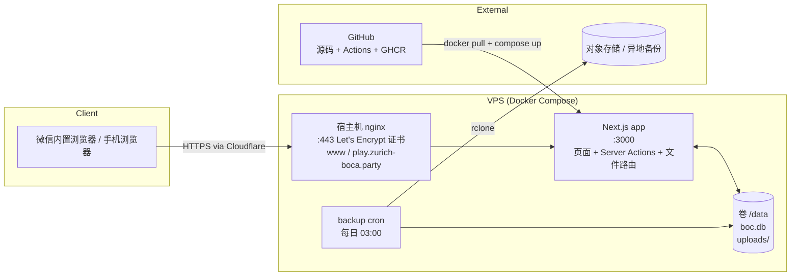
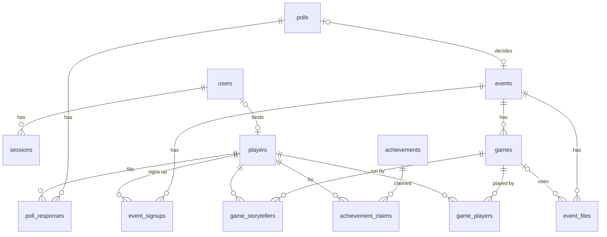

# BOC 技术架构设计

| 项目 | 内容 |
|---|---|
| 版本 | v0.4 |
| 日期 | 2026-09-05 |
| 对应需求 | [requirements.md](requirements.md) |

---

## 0. 设计约束：仓库自包含

**长期目标**：这个仓库要能自己站起来。在一台只装了 Docker 的干净机器上，
`git clone` + 拷一份 `data/` 目录 + `docker compose up -d`，整站（含 TLS）就跑起来了，
中间不需要任何手工的宿主机配置。

为什么在意这个：这是个一个人维护的小站，换 VPS、换云、临时搬到别的机器都是会发生的事。
如果部署知识散落在某台机器的 `/etc` 里，那些知识迟早会丢，搬家就变成一次考古。
把它压进仓库，搬家才是一条命令。

**这条约束怎么落到日常决策上**：

- 要加新组件（反代、定时任务、队列、缓存）→ 在 `deploy/docker-compose.yml` 里加服务，
  配置文件进仓库；不要让人去宿主机 `apt install` 或手改 `/etc`。
- 路径、域名、端口一律走环境变量。代码里出现 `/opt/...`、具体域名或 IP 都是 bug。
- 所有状态收在一个卷里（现在是 `./data` → `/data`），备份和迁移就只是拷一个目录。

**现状与目标的差距**。应用层已经达标了：镜像自带运行时和依赖，宿主机连 node 都没装，
状态只有一个 1.6 MB 的 `data/` 目录，代码不读任何硬编码路径。差的是它前面那一层：

| 欠的东西 | 现在在哪 | 打算怎么还 |
|---|---|---|
| nginx 反向代理 | `/etc/nginx/sites-enabled/` | compose 里加 Caddy，自动申请与续期证书 |
| Let's Encrypt 证书与续期 | `/etc/letsencrypt/` | 同上，Caddy 接管后这块整个消失 |
| 续期后 reload nginx 的 hook | `/etc/letsencrypt/renewal-hooks/deploy/` | 同上 |
| 每日备份 | 宿主机 root crontab | 放进容器，或加一个只跑备份的 sidecar |

**为什么现在不还**：现网那台机器的 80/443 已经被既有 nginx 占着，上面还跑着别的服务，
硬塞一个 Caddy 进去反而要多一层转发，风险大于收益。所以现状维持，
等真要换机器时再切到自包含版本。在那之前的新增功能，不要在这四项之外再添新的宿主机依赖。

---

## 1. 选型结论

**结论：VPS 上用 Docker Compose 跑一个 Next.js 全栈应用 + SQLite 数据库 + 本地文件存储，复用宿主机现有 nginx 与 Cloudflare 证书做 HTTPS。**

一句话理由：这是一个几十个人用、每周一次写入高峰的站点。单进程 + 单文件数据库完全够用，而且备份、迁移、回滚都是"复制一个目录"的事。你已经有 VPS 和域名，不需要再引入云服务。

### 1.1 方案对比

| 维度 | A. VPS + Docker + SQLite（推荐） | B. Azure App Service / Static Web Apps + Azure SQL + Blob | C. Vercel + Supabase |
|---|---|---|---|
| 月成本 | 0（已有 VPS） | 约 15–30 CHF（App Service B1 + SQL Basic + Blob） | 0（免费额度内），但 Supabase 免费项目 7 天无活动会暂停 |
| 运维复杂度 | 低：一个 compose 文件，两个容器 | 中：要配 App Service、SQL 防火墙、Blob SAS、自定义域名证书 | 低，但要管两家平台的配置 |
| 数据所有权 | 完全自有 | 在 Azure | 在 Supabase（美国 / 欧洲区可选） |
| 备份 | `cp` 一个目录 + 每日同步到对象存储 | Azure 自带，但恢复流程繁琐 | 免费版只有 7 天 PITR |
| 文件存储 | 本地磁盘 | Blob Storage | Supabase Storage（1 GB 免费） |
| 扩展性 | 到几千用户都没问题；再大换 Postgres | 高 | 高 |
| 冷启动 | 无 | Static Web Apps 的 Functions 有冷启动 | Vercel serverless 有冷启动 |
| 结论 | **选它** | 对本项目过重 | 可行，但引入两个外部依赖，收益不大 |

### 1.2 数据库：SQLite 而非 Postgres

| | SQLite | Postgres |
|---|---|---|
| 写入并发 | 单写多读；WAL 模式下对本项目绰绰有余 | 高 |
| 运维 | 无独立进程，一个文件 | 多一个容器、一套账号密码、一套备份工具 |
| 备份 | `sqlite3 .backup` 或 Litestream 连续复制 | `pg_dump` |
| 迁移到对方 | Drizzle ORM 换 driver + 改少量 SQL 方言即可 | — |

如果将来要多实例部署或数据量上百万行，再换 Postgres；Drizzle 的 schema 定义基本可以复用。

### 1.3 应用框架：Next.js 全栈

选择理由：

- 一个代码库同时解决页面、API、文件上传和权限，不需要前后端分离的额外联调。
- Server Actions 让"手机上点一下出席状态就保存"这种交互实现成本很低。
- 生态成熟，组件库（shadcn/ui）和表单校验（zod）拿来即用。

**备选：Django + Tailwind + HTMX。** 如果你更习惯 Python，Django 自带的 admin 后台能省掉大部分管理页面开发；代价是前端交互没那么顺滑，移动端 UI 要手写。见需求文档 Q9。

---

## 2. 技术栈

| 层 | 选择 | 版本 / 说明 |
|---|---|---|
| 语言 | TypeScript | strict 模式 |
| 框架 | Next.js（App Router、Server Actions、standalone 输出） | 16.x |
| UI | Tailwind CSS v4，自写少量组件 | 移动端优先 |
| 表单校验 | zod | 前后端共用 schema |
| ORM | Drizzle ORM + better-sqlite3 | 迁移文件入库，容器启动时自动执行 |
| 数据库 | SQLite（WAL 模式） | 文件位于 `/data/boc.db` |
| 认证 | 仅管理员：bcrypt + 会话表 + HTTP-only cookie；玩家无账号 | 不引入 Auth.js |
| 文件存储 | 本地磁盘 `/data/uploads/` | 通过应用路由鉴权后返回，不直接暴露目录 |
| 图片处理 | sharp | 生成缩略图、去除 EXIF |
| 测试 | Vitest（单元）+ Playwright（少量端到端） | |
| 包管理 | pnpm | |
| 反向代理 | 宿主机 nginx + Let's Encrypt 证书 | 长期要收进 compose，见第 0 节 |
| 容器 | Docker + Docker Compose | |
| CI/CD | 原型：VPS 上 git pull + compose build；之后 GitHub Actions → GHCR → SSH | |
| 备份 | 每日 cron：`sqlite3 .backup` + `tar` uploads → rclone 到对象存储 | 备选 Litestream |

---

## 3. 系统结构



请求流程：

1. nginx 收到 HTTPS 请求，转发给 127.0.0.1:3100 的应用容器，`Host` 头原样透传。
2. `src/proxy.ts` 按 `Host` 分流（见 3.1）；公开页面直接渲染，`/admin/*` 由中间件检查管理员会话。
3. 页面在服务端渲染；写操作走 Server Actions，每个 action 内部再次校验权限。
4. 文件访问走 `/files/[id]` 路由：从数据库查文件元数据 → 读磁盘流式返回。

### 3.1 两个域名，一个应用

| 域名 | 定位 | 内部路径 |
|---|---|---|
| `www.zurich-boca.party` | 社团主页：介绍、新人指引、成就墙 | `src/app/www/*`（rewrite 加前缀，地址栏不可见） |
| `play.zurich-boca.party` | 功能站：报名、投票、个人中心、后台 | `src/app/(play)/*`（路径原样） |

同一个容器、同一个 SQLite，`src/proxy.ts` 读 `Host` 头决定 rewrite 到哪套页面：

- 主页站上出现功能站路径（`/admin`、`/me`、`/login`、`/events`、`/polls` …）→ 307 到 play 同路径
- 功能站上出现 `/www/*` → 307 到主页站
- 跨站跳转一律用 307（临时）不用 301：这套映射还会变（`/achievements` 之后要搬到主页站），
  301 会被浏览器和 Cloudflare 长期缓存。根域 → `www` 的 301 在 nginx 上做，那个是稳定的
- 域名常量与判定在 `src/lib/hosts.ts`（proxy 也 import 它，所以那个文件里不能有 native 依赖）
- 跨站链接一律用 `src/lib/urls.ts` 的 `wwwUrl()` / `playUrl()`，不硬编码域名
- 登录会话 cookie 只属于 play 站，**不放宽到 `.zurich-boca.party`**；主页站是匿名只读

本地开发：`www.localhost:3000` 是主页站，`play.localhost:3000`（以及裸 `localhost:3000`）是功能站。

---

## 4. 数据模型

### 4.1 ER 图



### 4.2 表定义

所有表都有 `id`（自增整数）、`created_at`、`updated_at`（ISO 8601 文本，UTC）。

**users** 账号（玩家可以完全不注册；账号只是绑定玩家档案 + 权限）

| 字段 | 类型 | 说明 |
|---|---|---|
| username | text unique | 登录名 3–32 位 |
| password_hash | text | bcrypt cost 12 |
| role | text | `member` / `admin` / `owner` |
| status | text | `active` / `pending` / `disabled` |
| player_id | int null unique | 绑定的玩家档案；删账号不删玩家 |
| admin_request | text null | 管理员申请理由；非空且 role=member 即待审批 |
| admin_requested_at | text null | |
| note | text null | |

**sessions**：`id`（随机 token，即 cookie `boc_session` 的值）、`user_id`、`expires_at`。

**players** 名册（`aliases` 是 JSON 字符串数组，注册用户可自助维护，最多 5 个）：`name`（unique）、`aliases`（JSON 数组）、`archived`。昵称匹配时同时查 name 与 aliases，忽略大小写与首尾空格。

**polls** 时间预填

| 字段 | 类型 | 说明 |
|---|---|---|
| saturday | text | `YYYY-MM-DD` |
| title | text | 默认 "9月6日–7日" |
| slots | text | JSON 数组，子集于 `sat_pm` / `sat_eve` / `sun_pm` / `sun_eve` |
| note | text null | |
| status | text | `open` / `decided` / `closed` |
| event_id | int null fk | 定下来后的活动 |

**poll_responses**（`unique(poll_id, player_id)`）：`slots`（JSON 数组）、`note`。

**events**

| 字段 | 类型 | 说明 |
|---|---|---|
| date | text | `YYYY-MM-DD` |
| title | text | |
| location / start_time / note | text null | |
| has_afternoon / has_evening | int | |
| status | text | `planned` / `done` / `cancelled` |

**event_signups**（`unique(event_id, player_id)`）

| 字段 | 类型 | 说明 |
|---|---|---|
| signup | text | `none` / `afternoon` / `evening` / `full` |
| signup_note | text null | 接龙备注原文 |
| seq | int null | 接龙序号 |
| source | text | `self` / `jielong` / `admin` |
| status | text | `active` / `cancelled`（本人取消，记录保留） |
| cancelled_at | text null | |
| no_show_waived | int | 1 = 管理员已免鸽 |
| attended | text | `none` / `afternoon` / `evening` / `full` |

派生：`no_show = 活动已结束 AND signup != 'none' AND attended = 'none' AND no_show_waived = 0`。
本人取消（`status='cancelled'`）保留 `signup` 值，所以照样算鸽，除非管理员免掉。

**games**

| 字段 | 类型 | 说明 |
|---|---|---|
| event_id | int fk | |
| session | text | `afternoon` / `evening` |
| seq | int | 当日第几局 |
| script_name | text | |
| script_file_id | int null fk event_files | |
| result | text | `good` / `evil` / `unknown` |
| note | text null | |
| recorded_by | int fk players | 记录者 |

**game_storytellers**：`game_id`、`player_id`。
**game_players**：`game_id`、`player_id`、`seat`（int null）、`role_id`（text null，剧本 JSON 里的 id）、`role_name`（text）、`note`。

**event_files**：`event_id`、`game_id`（null）、`kind`（`board_image` / `script_json` / `game_log`）、`session`、`original_name`、`storage_path`、`thumb_path`、`mime`、`size`、`script_name`、`script_author`、`role_count`、`uploaded_by`（admin）。

**achievements**

| 字段 | 类型 | 说明 |
|---|---|---|
| name | text unique | 成就名称 |
| description | text | 达成条件 |
| icon | text | emoji，默认跟所属角色走 |
| role | text | 角色名，如 `通用` / `厨师` / `麻脸巫婆`，与 `docs/achievements.tsv` 一致 |
| rarity | text | `common` / `rare` / `epic` / `legendary`，积分 1 / 3 / 5 / 10 |
| script_name | text null | 剧本专属成就的剧本名；null = 全局成就 |
| hidden / sort_order / active | | 隐藏、排序（成就墙内顺序 = 清单顺序）、是否上架 |

数据源是 `docs/achievements.tsv`（唯一数据源，从飞书导出）。
`npm run gen:achievements` 读它生成 `src/db/achievements-data.ts`；
`seedAchievements()` 在空表时把 55 条写进去，不受 `SEED_DEMO` 控制（这是正式数据）。

**achievement_claims**（`unique(achievement_id, player_id)`）

| 字段 | 类型 | 说明 |
|---|---|---|
| event_id / game_id | int null | 关联 |
| note | text null | |
| status | text | `pending` / `confirmed` / `rejected` |
| reviewed_by / reviewed_at / review_note | | |
| unlocked_at | text | 展示时间（`YYYY-MM-DD` 或 ISO 时间戳） |
| unlocked_at_text | text null | 日期不精确时显示这个（如「已不可考」），有值时优先于 `unlocked_at` |

**audit_logs**（`user_id` 记操作人）、**settings** 同前。

### 4.3 索引

- `poll_responses(poll_id)`、`event_signups(event_id)`、`event_signups(player_id)`
- `games(event_id)`、`game_players(game_id)`、`game_players(player_id)`
- `achievement_claims(achievement_id, status)`、`achievement_claims(player_id)`
- `events(date desc)`、`sessions(expires_at)`、`users(player_id)` unique

## 5. 目录结构

```
boc/
├── docs/                      # 需求与架构
├── src/
│   ├── app/                   # Next.js App Router
│   │   ├── layout.tsx         # 两站共用：html/body + globals.css
│   │   ├── (play)/            # 功能站 play.*：首页、events、polls、achievements、me、players、admin
│   │   │   └── layout.tsx     # 顶栏 + 底部 tab bar
│   │   ├── www/               # 主页站 www.*：介绍、新人指引（proxy rewrite 到这个前缀）
│   │   │   └── layout.tsx     # 主页站的顶栏 + 页脚
│   │   ├── api/health/route.ts
│   │   └── files/[id]/route.ts   # 鉴权后返回文件
│   ├── components/            # UI 组件（不用组件库，Tailwind + globals.css 里的 .btn/.card/...）
│   ├── db/
│   │   ├── schema.ts          # Drizzle schema
│   │   ├── index.ts           # 连接 + WAL + 启动迁移
│   │   └── migrations/        # drizzle-kit 生成
│   ├── lib/
│   │   ├── auth.ts            # 会话、密码、getCurrentUser、requireAdmin
│   │   ├── storage.ts         # 文件保存 / 缩略图 / 删除
│   │   ├── script-json.ts     # 剧本 JSON 校验与解析
│   │   ├── jielong.ts         # 接龙文本解析（EVT-07）
│   │   ├── hosts.ts           # 两站域名常量与分流判定（proxy 也 import）
│   │   ├── urls.ts            # wwwUrl() / playUrl() 跨站链接
│   │   └── labels.ts          # 中文映射、角色 emoji、稀有度工具
│   └── actions/               # Server Actions，按领域分文件
├── scripts/
│   └── gen-achievements.ts    # docs/achievements.tsv → src/db/achievements-data.ts
├── deploy/
│   ├── docker-compose.yml
│   ├── Caddyfile
│   └── .env.example
├── Dockerfile
└── .github/workflows/deploy.yml
```

---

## 6. 身份与权限

三层，从松到紧：

1. **游客**：不需要账号。每个写操作都带昵称字段，服务端按昵称（含别名，忽略大小写与多余空格）匹配或创建 `players` 记录。浏览器用 `localStorage.bocNickname` 记住昵称，纯客户端便利，**不是身份凭证**。
2. **注册玩家**（`role=member`）：`/register` 填昵称 + 用户名 + 密码，立即可用。注册时认领同名玩家档案（已被别人绑定则拒绝），没有就新建。登录后可在 `/me` 改自己的昵称与别名、看自己的报名和成就、改密码、申请管理员。**没有任何管理权限。**
3. **管理员 / owner**：`role=admin|owner`。管理类 Server Action 首行 `requireAdmin()` / `requireOwner()`。

实现要点：

- 密码 bcrypt cost 12；登录写 `sessions`，cookie `boc_session` 属性 `HttpOnly; SameSite=Lax; Max-Age=30d`，生产环境加 `Secure`。改密码会删掉该用户的全部会话。
- `lib/auth.ts` 提供 `getUser()` / `getAdmin()` / `requireUser()` / `requireAdmin()` / `requireOwner()`；`getUser` 用 React `cache` 包一层，一次请求只查一次库。
- `src/proxy.ts`（Next 16 的 middleware）只对 `/admin/*` 做「有没有 cookie」的粗判，没有就跳 `/login?next=…`；是不是管理员由页面和 action 自己判。
- **owner 初始化**：启动时 `users` 为空则用 `OWNER_USERNAME` / `OWNER_PASSWORD` 创建 `role=owner`。
- **管理员申请**：member 在 `/me` 提交理由写进 `users.admin_request`；owner 在 `/admin/admins` 批准（改 role 为 admin）或拒绝（清空字段）。
- **滥用防护**：公开写接口按 IP 内存限流；昵称长度 ≤ 20，别名 ≤ 5 个；昵称与别名在全名册唯一；管理员可改删任何记录。

## 7. 文件存储（已实现）

代码：`src/lib/storage.ts`（落盘 / 缩略图 / 删除）、`src/lib/script-json.ts`（剧本 JSON 解析，纯函数，有单测）、
`src/actions/files.ts`（上传 / 删除的 Server Action）、`src/app/files/[id]/route.ts`（取文件）。

- **权限**：只有管理员能上传和删除。站点是公开的，不能开匿名上传端点；未登录看活动页时只展示已有文件。
- **根目录** 取 `UPLOAD_DIR`（默认 `./data/uploads`，容器里是 `/data/uploads`，挂 Docker 卷）。
  路径 `{event_id}/{uuid}.{ext}`，**绝不用用户提供的文件名做路径**；原始文件名只存数据库，下载时当 filename 用。
  `absPath()` 会挡住任何试图跳出根目录的相对路径。
- **类型判断** 按 magic bytes（FFD8FF / PNG 8 字节签名 / RIFF…WEBP），认不出图片再看内容是不是 JSON 文本；
  完全不信任扩展名和浏览器给的 MIME。图片 ≤ 10 MB，JSON ≤ 1 MB，超限给中文错误。
- **图片**：sharp 重新编码（顺带去掉 EXIF）、`fit: inside` 限制最长边 2500 px，另存一张 400 px 的 `.thumb.jpg`。
- **JSON**：要求顶层为数组；首元素若是 `id === "_meta"` 的对象则读 `name` / `author`（`bootlegger` / `firstNight`
  等多余字段容忍），其余元素为字符串或含 `id` 的对象，计数为 `role_count`。**原文件原样保存，不重写**。
- **关联到局**：上传时可以选本活动的某一局；剧本 JSON 关联时会回填 `games.script_file_id`，活动页在那一局旁边显示剧本文件链接。
- **访问**：`GET /files/{id}`（`?thumb=1` 取缩略图）从数据库查元数据后 `createReadStream` 流式返回；
  图片 `Content-Disposition: inline`，JSON 用 `attachment` 并带 UTF-8 编码的原始文件名；
  内容写进去就不变，所以 `Cache-Control: public, max-age=31536000, immutable`。
- **删除**：先删数据库记录（顺带清掉引用它的 `games.script_file_id`），再删磁盘文件（原图 + 缩略图）；
  磁盘上没有不报错。删整个活动时连它的上传目录一起删。
- **body 限制**：上传走 Server Action，Next 默认只收 1 MB，所以 `next.config.ts` 里
  `experimental.serverActions.bodySizeLimit = "32mb"`，nginx 的 `client_max_body_size` 也是 32m，两处要一致。

---

## 8. 部署

对服务器的要求只有一条：装了 Docker 和 Compose。下面这套是现网的做法——宿主机上已经有 nginx 在占用 80/443，所以复用它做反代，而不是再起一个 Caddy。如果是一台干净的机器，直接用 Caddy 会更省事（见第 0 节）。

### 8.1 步骤

1. Cloudflare DNS：`play`、`www` 和根域三条记录 → VPS IP，**开启代理（橙云）**。
2. 应用目录 `/opt/boc`：`docker-compose.yml`、`.env`、`data/`。
3. nginx site `deploy/nginx/play.zurich-boca.party.conf` 和 `www.zurich-boca.party.conf`：80 放行 ACME 校验、其余 301 到 https；443 用 Let's Encrypt 证书，`client_max_body_size 32m`，两个站都 `proxy_pass http://127.0.0.1:3100` 且透传 `Host`。
4. `docker compose up -d --build`（原型阶段在 VPS 上直接构建；之后改为 GitHub Actions 构建推 GHCR）。

### 8.2 docker-compose.yml

```yaml
services:
  app:
    build: .
    image: boc:latest
    restart: unless-stopped
    env_file: .env
    ports: ["127.0.0.1:3100:3000"]
    volumes:
      - ./data:/data
```

### 8.3 环境变量（`.env.example`）

| 变量 | 说明 |
|---|---|
| `DATABASE_PATH` | `/data/boc.db` |
| `UPLOAD_DIR` | `/data/uploads` |
| `OWNER_USERNAME` / `OWNER_PASSWORD` | 首次启动创建 owner |
| `APP_URL` | `https://play.zurich-boca.party` |
| `WWW_HOST` / `PLAY_HOST` | 两站域名，默认 `www.` / `play.zurich-boca.party` |
| `TZ` | `Europe/Zurich` |

### 8.4 更新与回滚

```bash
cd /opt/boc && git pull && docker compose up -d --build
```

回滚：`git checkout <上一个 sha> && docker compose up -d --build`。数据库迁移只增不减，向前兼容。

## 9. 备份与恢复

脚本在仓库里：`scripts/backup.sh` / `scripts/restore.sh`。

VPS 上加一条 cron：

```
0 3 * * * /opt/boc/scripts/backup.sh >> /var/log/boc-backup.log 2>&1
```

备份做两件事：容器里用 SQLite 的在线备份 API 取一份一致的 `boc.db` 快照（不用停服务），
再把 `uploads/` 打包，一起放进 `/opt/boc/backups/YYYY-MM-DD/`，保留 30 天。
配好 rclone 之后把脚本里 `rclone sync` 那行的注释去掉，就有异地副本了。

恢复：`scripts/restore.sh 2026-09-05`，脚本会停容器、覆盖数据、改回属主、再起来。

健康检查：`GET /api/health` 返回 `{"ok":true,"achievements":55}`，能开库并查得动才算健康。
可以挂到 nginx 或外部监控上。

## 10. 安全清单

- [ ] 全站 HTTPS，HSTS
- [ ] 密码 bcrypt，永不记录明文；临时密码只显示一次
- [ ] 所有 Server Action 首行权限校验
- [ ] 上传文件 magic bytes 校验、大小限制、重新编码图片、不可执行
- [ ] 文件路由鉴权，路径由数据库映射，不接受用户传入路径
- [ ] 登录限流；注册需邀请码
- [ ] 依赖用 Dependabot 自动更新；Docker 基础镜像每月重建
- [ ] 审计日志覆盖删除与权限变更
- [ ] `.env` 与 `data/` 不进 git

---

## 11. 性能与容量

- SQLite WAL 模式，`synchronous=NORMAL`，`busy_timeout=5000`。
- 列表页分页（活动每页 20 条）；成就墙一次加载全部（预计 < 100 条）。
- 缩略图 400 px，避免手机上加载 5 MB 原图。
- 预估 3 年数据量：150 次活动 × 3 个文件 × 3 MB ≈ 1.5 GB 上传文件；数据库 < 20 MB。

---

## 12. 开发流程

1. `pnpm install && pnpm dev`，本地 SQLite 在 `./data/boc.db`。
2. 改 schema → `pnpm drizzle-kit generate` 生成迁移 → 提交迁移文件。
3. 提交 PR，CI 跑 lint / 测试；合并到 `main` 自动部署。
4. 骨架阶段结束后补 `CLAUDE.md`，记录命令与约定。
